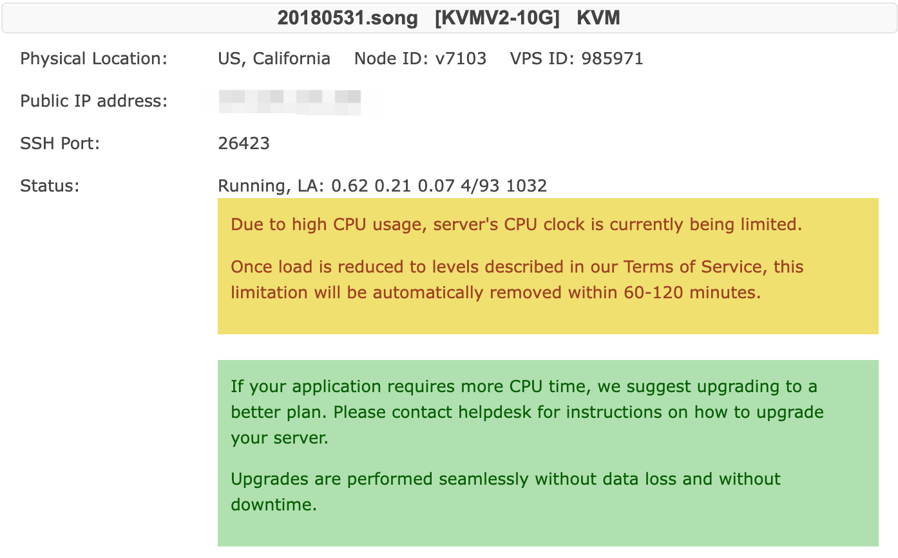

搬瓦工 VPS 由于“high CPU usage”被暂停的原因和解决方法

> Due to high CPU usage, server's CPU clock is currently being limited.
Once load is reduced to levels described in our Terms of Service, this limitation will be automatically removed within 60-120 minutes.

翻译：你的 vps 因为 cpu 使用过高被限制使用。

解决办法：
重启 vps ，暂停耗费 cpu 的程序。

