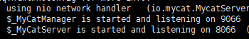

**安装 jdk**
On the command line, type:
```shell
$ su -c "yum install java-1.8.0-openjdk"
```
The java-1.8.0-openjdk package contains just the Java Runtime Environment. If you want to develop Java programs then install the java-1.8.0-openjdk-devel package.

**安装 mycat**
在[官网](http://mycat.io/)下载相应的版本。
```
wget http://dl.mycat.io/1.6-RELEASE/Mycat-server-1.6-RELEASE-20161028204710-linux.tar.gz
tar zxvf Mycat-server-1.6-RELEASE-20161028204710-linux.tar.gz
./mycat/bin/mycat console
```

**配置 mycat**
先配置server.xml里的user，用户名与密码随意和数据库的密码没关系，只作为登陆mycat的密码
然后配置schema.xml

连接测试，管理端口9066，服务端口8066
mysql -h127.0.0.1 -P8066 -uroot -proot


出现问题
 2018-06-13 15:20:11,571 [ERROR][WrapperSimpleAppMain] 2018-06-13 15:20:11 startup error java.lang.NumberFormatException: Size must be specified as bytes (b)
解决办法
配置文件server.xml中


参考
[How to download and install prebuilt OpenJDK packages](http://openjdk.java.net/install/)
[Mycat 实现 MySQL 读写分离](https://www.jianshu.com/p/cb7ec06dae05)
[Mycat安装部署+读写分离](https://segmentfault.com/a/1190000009520414)