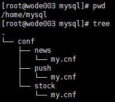

## 基于docker环境安装mysql双主

master1：192.168.1.77
master2：192.168.1.125

架构图如下：

公司在业务上使用了分库，一共有3个不同版本的mysql，因此需要搭建三套mysql主从。
创建配置文件

mkdir -p /home/mysql/conf
cd /home/mysql/conf
mkdir news stock push

编辑一个配置文件
vi my.cnf
[mysqld]
log-bin=mysql-bin
server-id=77 #一般为ip最后一段，在master2上记得改成125

使用docker命令在master1和master2上分别执行安装命令。安装docker请参考这里。

docker run -p 3307:3306 --restart=always --name news -v /home/mysql/conf/news:/etc/mysql/conf.d -e MYSQL_ROOT_PASSWORD=test -d mariadb:5.5
docker run -p 3308:3306 --restart=always --name stock -v /home/mysql/conf/stock:/etc/mysql/conf.d -e MYSQL_ROOT_PASSWORD=test -d percona/percona-server:5.6
docker run -p 3309:3306 --restart=always --name push -v /home/mysql/conf/push:/etc/mysql/conf.d -e MYSQL_ROOT_PASSWORD=test -d mysql:5.7

>注：
* 最合理的做法是把mysql的数据使用-v参数挂载到主机，遇到异常的话可以迁移数据卷恢复数据。这种方式适合有专门dba管理员的公司，由dba统一分配和管理不同数据库的数据卷，以防其他人员不小心更改或删除数据卷中的内容，造成数据的不可用。
* "-p 端口:端口"方式会暴露外网端口，生产环境建议使用"-p ip地址:端口:端口"方式映射。如：docker run -p localhost:3307:3306 -p 127.0.0.1:3307:3306 

测试登录
mysql -h127.0.0.1 -P3307 -uroot -p

然后创建一个具有复制权限的用户
GRANT REPLICATION SLAVE ON *.* to 'repl2018'@'%' identified by 'repl2018';
flush privileges;

查看主节点状态
show master status;
记录下LOG_FILE，LOG_POS的值在下一步中有用

配置主从同步
CHANGE MASTER TO 
MASTER_HOST='192.168.1.180',
MASTER_PORT=3307,
MASTER_USER='test',
MASTER_PASSWORD='test',
MASTER_LOG_FILE='mysql-bin.000004',
MASTER_LOG_POS=460;

查看是否启动
start slave;
show slave status\G;
> Slave_IO_Running: Yes
Slave_SQL_Running: Yes

同理在其他mysql中执行执行以上命令，注意根据情况更改主机、端口、日志文件等参数。

