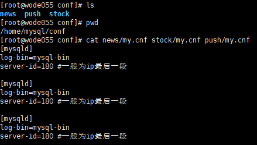
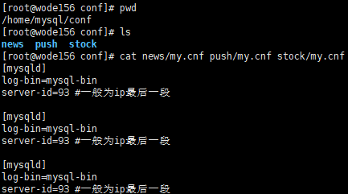
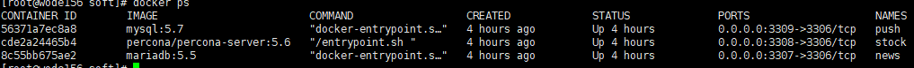

三套mysql双主

master1：
master2：

master1配置文件

master2配置文件

分别在两个节点安装mysql
docker run -p 3307:3306 --restart=always --name news -v /home/mysql/conf/news:/etc/mysql/conf.d -e MYSQL_ROOT_PASSWORD=root -d mariadb:5.5
docker run -p 3308:3306 --restart=always --name stock -v /home/mysql/conf/stock:/etc/mysql/conf.d -e MYSQL_ROOT_PASSWORD=root -d percona/percona-server:5.6
docker run -p 3309:3306 --restart=always --name push -v /home/mysql/conf/push:/etc/mysql/conf.d -e MYSQL_ROOT_PASSWORD=root -d mysql:5.7

mysql -h127.0.0.1 -P3307 -uroot -pStock@2016
mysql -h127.0.0.1 -P3308 -uroot -pStock@2016
mysql -h127.0.0.1 -P3309 -uroot -pStock@2016

GRANT REPLICATION SLAVE ON *.* to 'repl2018'@'%' identified by 'repl2018';
flush privileges;
show grants for 'repl2018'@'%';

show master status;
注意改ip
CHANGE MASTER TO 
MASTER_HOST='192.168.1.180',
MASTER_PORT=3307,
MASTER_USER='repl2018',
MASTER_PASSWORD='repl2018',
MASTER_LOG_FILE='mysql-bin.000004',
MASTER_LOG_POS=460;

start slave;
show slave status\G;
