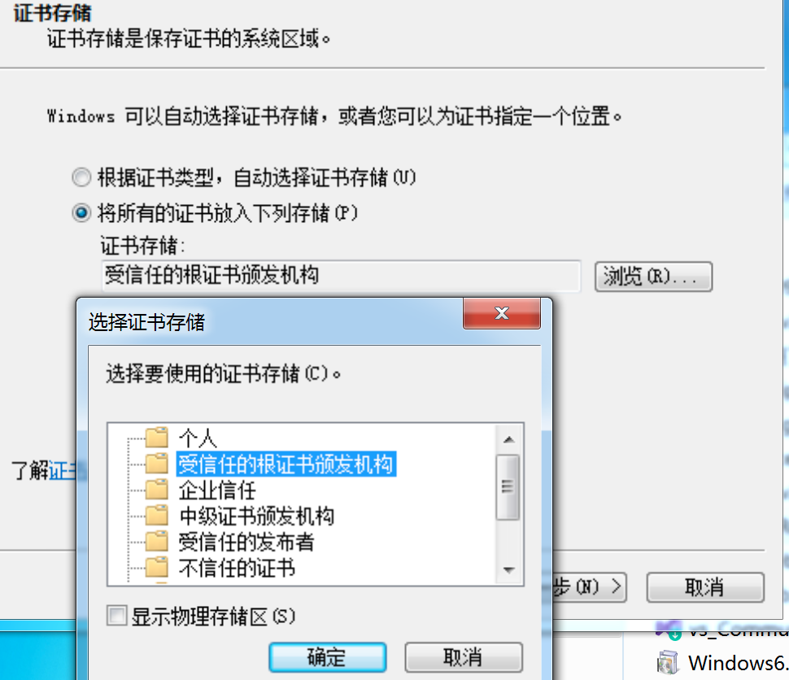

所需工具
- [microsoft-net-framework-4-8](https://support.microsoft.com/zh-cn/topic/%E9%80%82%E7%94%A8%E4%BA%8E-windows-%E7%9A%84-microsoft-net-framework-4-8-%E8%84%B1%E6%9C%BA%E5%AE%89%E8%A3%85%E7%A8%8B%E5%BA%8F-9d23f658-3b97-68ab-d013-aa3c3e7495e0)
- [Visual Studio Community ](https://visualstudio.microsoft.com/zh-hans/vs/)

## 遇到的问题
问题：已处理证书链，但是在不受信任的根证书中终止
解决方法：
	1. 下载[证书](http://go.microsoft.com/fwlink/?LinkID=747875&clcid=0x409)
	2. 点击安装，选择存储位置为“受信任的根证书颁发机构”

问题：时间戳签名和或证书无法验证或已损坏
解决：安装[系统补丁](https://www.microsoft.com/zh-CN/download/details.aspx?id=39115)